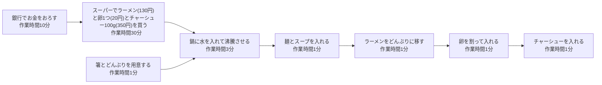

```mermaid
flowchart LR
    bunk["銀行でお金をおろす
    作業時間10分"]
    super["スーパーでラーメン(130円)と卵1つ(20円)とチャーシュー100g(350円)を買う
    作業時間30分"]
    water["鍋に水を入れて沸騰させる
    作業時間3分"]
    in["麺とスープを入れる
    作業時間1分"]
    sara["ラーメンをどんぶりに移す
    作業時間1分"]
    egg["卵を割って入れる
    作業時間1分"]
    meat["チャーシューを入れる
    作業時間1分"]
    hashi["箸とどんぶりを用意する
    作業時間1分"]
    bunk-->super
    super-->water
    hashi-->water
    water-->in
    in-->sara
    sara-->egg
    egg-->meat
```