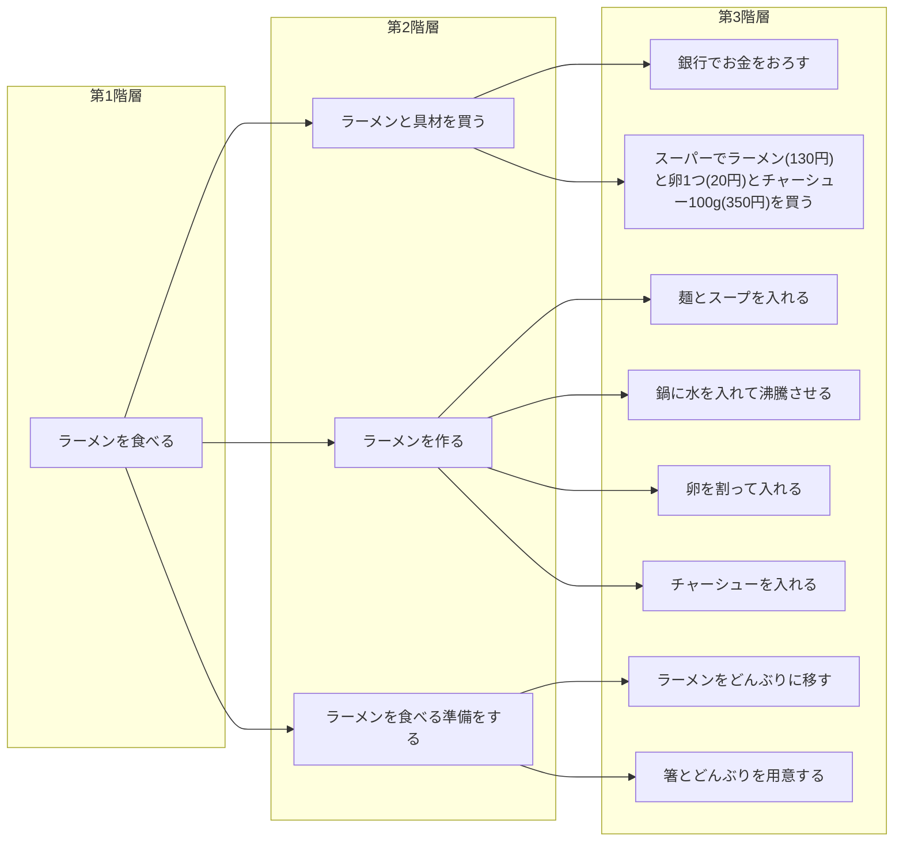

```mermaid
flowchart LR
    subgraph "第1階層"
    eat["ラーメンを食べる"]
    end
    subgraph "第2階層"
    buy["ラーメンと具材を買う"]
    make["ラーメンを作る"]
    take["ラーメンを食べる準備をする"]
    end
    eat-->buy
    eat-->make
    eat-->take
    subgraph "第3階層"
    bunk["銀行でお金をおろす"]
    super["スーパーでラーメン(130円)と卵1つ(20円)とチャーシュー100g(350円)を買う"]
    buy-->bunk
    buy-->super
    water["鍋に水を入れて沸騰させる"]
    in["麺とスープを入れる"]
    sara["ラーメンをどんぶりに移す"]
    egg["卵を割って入れる"]
    meat["チャーシューを入れる"]
    hashi["箸とどんぶりを用意する"]
    make-->in
    make-->water
    make-->egg
    make-->meat
    take-->sara
    take-->hashi
    end
```