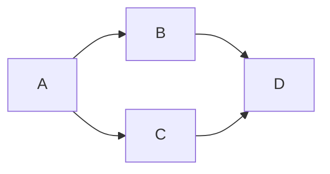
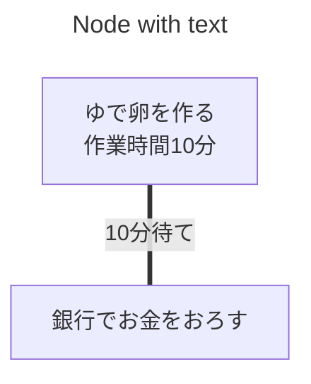
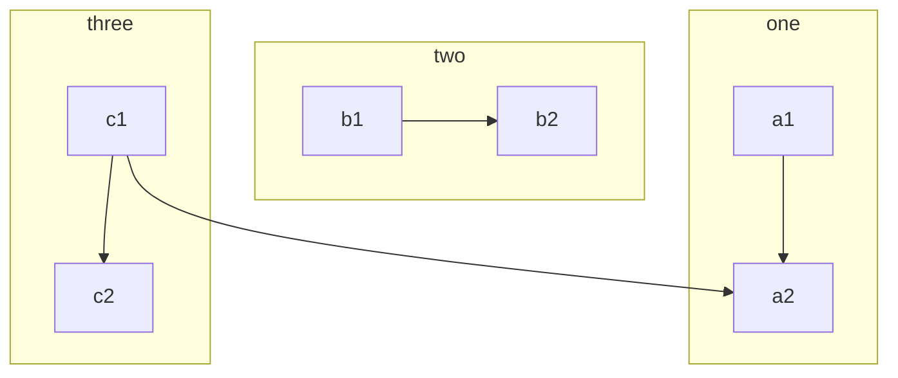
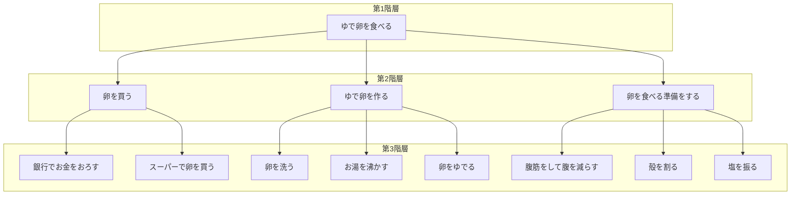

```mermaid
graph LR;
    A-->B;
    A-->C;
    B-->D;
    C-->D;
```

```mermaid
---
title: Node with text
---
flowchart BT
    id1["銀行でお金をおろす"]
    cook["ゆで卵を作る
    作業時間10分"]
    id1==10分待て===cook
```

```mermaid
flowchart TD
    c1-->a2
    subgraph one
    a1-->a2
    end
    subgraph two
    b1-->b2
    end
    subgraph three
    c1-->c2
    end

```

```mermaid
flowchart TD
    subgraph "第1階層"
    eat["ゆで卵を食べる"]
    end
    subgraph "第2階層"
    buy["卵を買う"]
    make["ゆで卵を作る"]
    take["卵を食べる準備をする"]
    end
    eat-->buy
    eat-->make
    eat-->take
    subgraph "第3階層"
    bunk["銀行でお金をおろす"]
    super["スーパーで卵を買う"]
    buy-->bunk
    buy-->super
    wash["卵を洗う"]
    water["お湯を沸かす"]
    boil["卵をゆでる"]
    make-->wash
    make-->water
    make-->boil
    muscle["腹筋をして腹を減らす"]
    break["殻を割る"]
    solt["塩を振る"]
    take-->muscle
    take-->break
    take-->solt
    end
```