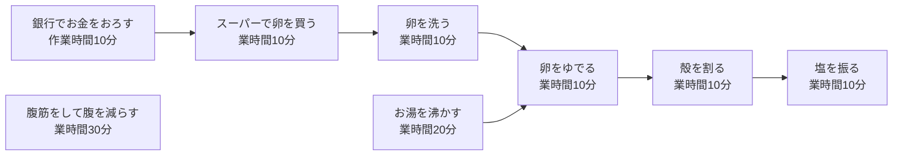

```mermaid
flowchart LR
    bunk["銀行でお金をおろす
    作業時間10分"]
    water["お湯を沸かす
    業時間20分"]
    super["スーパーで卵を買う
    業時間10分"]
    bunk-->super
    super-->wash
    wash["卵を洗う
    業時間10分"]
    boil["卵をゆでる
    業時間10分"]
    wash-->boil
    water-->boil
    muscle["腹筋をして腹を減らす
    業時間30分"]
    break["殻を割る
    業時間10分"]
    solt["塩を振る
    業時間10分"]
    boil-->break
    break-->solt
```